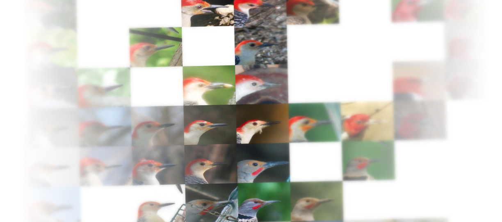

Stochastic Neighbor and Crowd Kernel (SNaCK) embedding
======================================================

Quick and dirty visualization of large-scale datasets via concept embeddings

This code (and the [companion paper](http://vision.cornell.edu/se3/projects/concept-embeddings/)) showcase our work on “SNaCK,” a low-dimensional concept embedding algorithm that combines human expertise with automatic machine similarity kernels. Both parts are complimentary: human insight can capture relationships that are not apparent from the object’s visual similarity and the machine can help relieve the human from having to exhaustively specify many constraints.

As input, our SNaCK algorithm takes two sources:

- **Several "relative similarity comparisons."** Each constraint has
the form (a,b,c), meaning that in the lower-dimension embedding Y,
Y[a] should be closer to Y[b] than it is to Y[c]. Experts can generate
many of these constraints using
[crowdsourcing](http://vision.cornell.edu/se3/projects/cost-effective-hits/).
- **Feature vector representations of each point.** For instance, such features could come from HOG, SIFT, a deep-learned CNN, word embeddings, or some other representation.

SNaCK then generates an embedding that satisfies both classes of constraints.

Usage
=====
See
http://nbviewer.ipython.org/github/cornelltech/snack/blob/master/Examples.ipynb
for documentation on SNaCK's parameters and example usage.

Try SNaCK out in your web browser!
==================================
[Launch an IPython Notebook with SNaCK in your web browser!](http://mybinder.org/repo/cornelltech/snack-zeroinstall) This environment has a copy of SNaCK and comes pre-loaded with a copy of the [Food-10k dataset](http://vision.cornell.edu/se3/projects/concept-embeddings/) for you to explore.

*Caveat*: Run the first cell containing the `conda` command and *wait for it to
complete* before running anything else! If you get an error, restart the running
Kernel and try again.

This service is made possible by the folks at [binder](http://mybinder.org/)

Installation
============
The following platforms are supported:
- Python 2.7 on Linux, x64
   - Binary packages available on Conda
   - Source packages available from Pip
- Python 2.7 on OSX
   - Binary packages for Yosemite available on Conda
   - Source packages available from Pip (Homebrew-GCC required)

Linux and Mac OS X: Install from Conda (Preferred)
--------------------------------------------------
Please use Conda. Your life will be easier.

Just run:

    $ conda install -c https://conda.anaconda.org/gcr snack

If you insist on compiling from source, read on:

Linux: Install from source with Pip
-----------------------------------
Just run:

    $ pip install snack

You need to install Python 2.7, Numpy, and Cython. You also need a
working compiler, CBLAS, and the Python development headers, which are
installable from your distribution's package manager.

To install SNaCK and its dependencies on a clean Ubuntu Trusty x64
system, run:

    # sudo aptitude install \
      build-essential       \
      python-dev            \
      libblas3              \
      libblas-dev           \
      python-virtualenv
    $ virtualenv venv; source venv/bin/activate
    $ pip install numpy
    $ pip install cython
    $ pip install snack

OS X: Install from source with Pip and Homebrew
-----------------------------------------------
SNaCK uses OpenMP. This makes compilation tricky on Mac OS X.

If you are on Mac OS X, you must install the real "not-clang" version
of gcc because it has OpenMP support. At the time of writing, clang
does not support OpenMP, and Apple has unhelpfully symlinked clang to
`/usr/bin/gcc`. This will not work.

Using Apple-provided GCC is NOT supported. If `gcc-5 --version`
contains the string `clang` anywhere in its output, you do not have
the correct version of gcc.

Using Apple-provided Python is NOT supported.

The recommended installation method on OS X is with Homebrew. The
following has been tested on a clean Yosemite installation.

    $ brew install gcc
    $ brew install python
    $ virtualenv venv; source venv/bin/activate
    $ pip install numpy
    $ pip install cython
    $ pip install snack

You may need to edit `setup.py` and change `GCC_VERSION` to point to
the correct version if you are not using `/usr/local/bin/gcc-5`.
